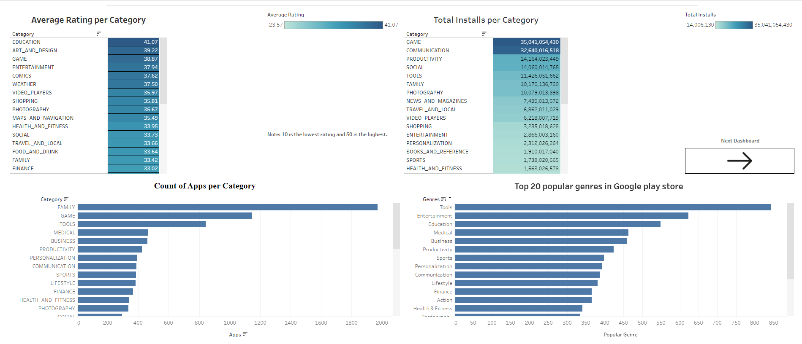
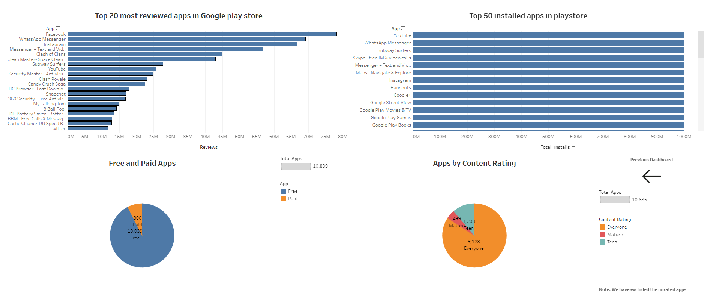

# Google-Play-Store-Applications-Analysis
Web scraped data of nearly 11K Play Store apps from 2016-2018 for analyzing the Android market.

# Data Content:

There are 13 features in the dataset, and each feature indicates some details of Google application name, category, rating, reviews, size, installs, type, price, content rating genres, last updated, current version and Android version.
- App: The application name.
- Category: The category the app belongs to.
- Rating: Overall user rating of the app.
- Reviews: Number of user reviews for the app.
- Size: The size of the app.
- Installs: Number of user installs for the app.
- Type: Either "Paid" or "Free".
- Price: The price of the app.
- Content Rating: The age group the app is targeted at - "Children" / "Mature" / "Adult".
- Genres: Possibly multiple genres the app belongs to.
- Last Updated: The date the app was last updated.
- Current Ver: The current version of the app.
- Android Ver: The Android version is needed for this app.

# Project Objective
1. Determine how many apps are available in each category on the Google Play Store.
2. Find out the average user rating for apps within each category.
3. Identify the 20 apps with the most reviews.
4. Highlight the app categories with the highest total number of installs
5. Compare the number of free apps to paid apps.
6. Determine the most popular genres based on the number of apps or installs.
7. Analyze the distribution of apps according to their content rating (e.g., Everyone, Teen, Mature).
8. List the 50 apps with the highest number of installs.

# Visualization report
The report comprises two dashboards. You can interact with the dashboard [here](https://public.tableau.com/app/profile/christos.passas/viz/GooglePlaystoreAnalysis_dashboard/GooglePlaystoreAnalysis_Dashboard1)
##### First Dashboard:
- Determine how many apps are available in each category on the Google Play Store.
- Find out the average user rating for apps within each category.
- Determine the 20 most popular genres based on the number of apps or installs.
- Highlight the app categories with the highest total number of installs

##### Second Dashboard:
- Identify the 20 apps with the most reviews.
- Compare the number of free apps to paid apps.
- Analyze the distribution of apps according to their content rating (e.g., Everyone, Teen, Mature).
- List the 50 apps with the highest number of installs.

# Conclusion
  - This analysis can reveal which categories are most crowded, indicating high competition, and which are less saturated, potentially offering new market opportunities.
  - Categories with higher average ratings may indicate higher user satisfaction.
  - Apps with a high number of reviews are often those that have achieved significant user engagement.
  - Understanding which categories have the most installs can help developers identify where users are most active, and potentially, where the money flows.
  - This analysis sheds light on the prevailing monetization strategies within the Google Play Store and can help developers decide whether to offer their app for free or as a paid download.
  - Also can indicate which age groups are most catered to in the app market, helping developers target their apps more effectively to the right audience.
  - Identifying popular genres can help developers understand user preferences and market trends, guiding them in genre selection for their next app project.
  - Lastly, understanding which apps have the most installs can provide a benchmark for success and offer insights into features, app types, or marketing strategies that resonate with a large user base.

# Source/Credit 
https://www.kaggle.com/datasets/bhavikjikadara/google-play-store-applications
